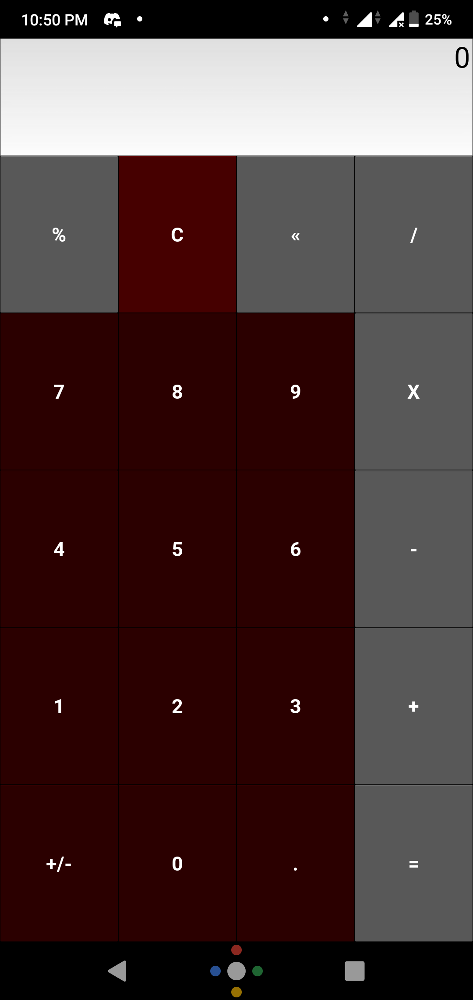
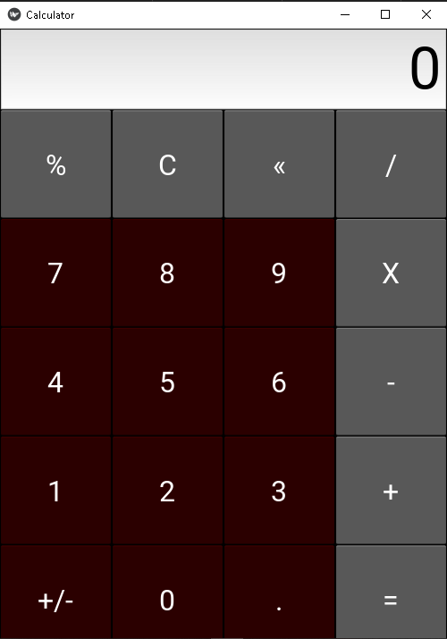

# Kivy app in Android and Windows

This app is built for learning purposes and use to solve the basics of Mathematical operations, In future, I will apply the same concept to build the App integrated to **Machine Learning** concept

## Authors

- [@itneshkumar](https://github.com/itneshkumar)

  
## Deployed APP

[Android](https://drive.google.com/uc?export=download&id=1d0iXtGUyR_IFZjT-63M07UG12VNlkOfE)

Windows Executable folder 

Go to Calc folder unzip them and run the calc.exe file

### wireframe of APP
Android

 
Windows

## License

[MIT](https://choosealicense.com/licenses/mit/)

  
